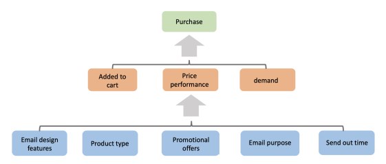

Please note that the main topic studied in this project is not about identifying a causal estimand in a specific problem, but more about one kind of methods estimating effects for time-varying treatment strategies with causal relationship.

# Motivation (HW2)

Many real-world causal inference applications require us to study the effects of treatments along time, i.e., dynamic treatment. In healthcare applications, physicians apply several treatments over time, such as different drug dosage levels, types of exercise, and amount of exercise, to achieve some clinical outcomes [(Liu et al., 2020)](#2). As the action progresses, the patient's status changes accordingly. 

One the one hand, some studies on modern learning methods have been done to model and solve this type of tasks. In the field of deep learning, some sequential deep learning framework under dynamic time varying treatment strategies in complex longitudinal settings have been introduced [(Li et al., 2021)](#1). On the other hand, understanding causal relationships may help us to construct more efficient learning models, like reinforcement learning (RL), where the agent receives feedback from the environment sequentially and aim to optimize the decision policy within a given time period. 

Random variables may vary for different applications. They can be healthcare treatments and clinical outcomes along time, or promotional offers and final purchases in digital market problems. The causal effect may be average effect as function of random variables, including potential outcomes, from the set of random variables mentioned above. The hypotheses about the relationship between variables may be described in DAG, like in [(Yangyi et al., 2022)](#3):

# Introduction (HW2 & HW3)

In this course project, I would like to study one type of methods for estimating the effects of general dynamic treatment strategies conditioned on historical data with a generalized problem setting for patient outcomes under time-varying treatment strategies based on observed patient behaviors. In addition, I will try to understand how they can work together for dynamic treatment. The main reference for this project are Li, Rui, et al. "G-Net: a Recurrent Network Approach to G-Computation for Counterfactual Prediction Under a Dynamic Treatment Regime." [(Li et al., 2021)](#1). PMLR, 2021 and other related materials.

## Counterfactual prediction

Counterfactual prediction	is a fundamental problem in making estimation of expected future values of variables under alternative choices of action given observed history. Counterfactual prediction is a causal task where it must account for the causal effects of treatment strategies which are different from the strategies applied.

## G-method

Treatment strategies are usually time-varying, where decisions are made at multiple time points, and dynamic, where decisions are formed as a function of the previous history at each time point. For time-varying treatment strategies with treatment-confounder feedback, there are one kind of approaches known as “G-methods” [(Robins and Hernan, 2009)](#4) that perform well in estimating their effects. Many models have been proposed in the field of G-methods, including G-computation, structural nested models, and marginal structural models. In this project, I will focus on G-computation.

## G-computation

G-computation is good at  estimating the effects of general dynamic treatment strategies conditioned on patient histories [(Daniel et al., 2013)](#5). A property favored by people is that the G-computation algorithm may take arbitrary regression models as input embedding model. However, introducing simple regression models in G-computation algorithm will cause limited capacity to capture complicated temporal and nonlinear causal structures.

# Problem setting (HW2 & HW3)

## G-computation for counterfactual prediction

The goal for this problem is to predict patient outcomes under various future treatment strategies given observed patient histories [(Li et al., 2021)](#1). Let:
- $t\in \lbrace 0,...,K\rbrace$: discrete time
- $A_t$: treatment action at time $t$
- $Y_t$: potential outcome at time $t$
- $L_t$: vector of covariates at time $t$ that may influence treatment decisions or be associated with the outcome
- $\overline{X}_t, \underline{X}_t$: are respectively history and future of a time-varying variable $X$
- $H_t=(\overline{L}_t, \overline{A}_{t-1})$: the patient history at but before time $t$
- $g=\lbrace g_0,...,g_K\rbrace $: dynamic treatment strategy, a collection of decision functions that map $H_t$ onto a treatment action at time $t$

Therefore, $Y_t(g)$ is the counterfactual outcome observed at time $t$ had, possibly contrary to fact, given that treatment strategy $g$ been followed from baseline (Robins, 1986). Let $Y_t(\overline{A}_{m−1}, \underline{g}_m), t>m$ denote the counterfactual outcome that would be observed if patient had received their observed treatments $\overline{A}_{m−1}$ up to time $m − 1$ then followed strategy $g$ starting from time $m$. Here $g$ can be regarded as the experts.

The goal for counterfactual point prediction is to estimate expectation of counterfactual patient outcome 
$$E[Y_t(\overline{A}_{m−1}, \underline{g}_m)|H_m], t ≥ m$$
given observed patient history through time m for any m and any specified treatment strategy g. Another thing that we may be interested in estimating is the counterfactual outcome distributions at future time points 
$$p(Y_t(\overline{A}_{m−1}, \underline{g}_m)|H_m), t ≥ m$$

## Assumptions

To estimate the expectation and distribution of counterfactual patient outcome, we need three assumptions [(Li et al., 2021)](#1):

1. Consistency: $\overline{Y}_K(A_K) = \overline{Y}_K$. This means the observed outcome is equal to the counterfactual outcome corresponding to the observed treatment
2. Sequential Exchangeability: $\underline{Y}_t(g) \perp A_t|H_t, \forall t$. This means all confounding are observed. This would hold, e.g., if all drivers of treatment decisions that were prognostic for the outcome were observed.
3. Positivity: $P(A_t = g_t(H_t)) > 0, \forall \lbrace H_t:P(H_t) > 0\rbrace$. This means the counterfactual treatment strategy of interest has some non-zero probability of actually being followed. Positivity is not strictly necessary.

## Identification

Under assumptions 1-3, for $t = m$ we have the identification equality stating that the conditional distribution of the counterfactual is the conditional distribution of the observed outcome given patient history and given that treatment follows the strategy of interest [(Li et al., 2021)](#1):

$$p(Ym(A¯m−1, gm)|Hm) = p(Ym|Hm, Am = gm(Hm))$$

For $t > m$, we need to adjust for time-varying confounding. With $X_{i:j} = X_i,..., X_j$ for any random variable X[(Li et al., 2021)](#1):

\begin{aligned}
&p\left(Y_t\left(\bar{A}_{m-1}, \underline{g}_m\right)=y \mid H_m\right) \\
&=\int_{l_{m+1: t}} p\left(Y_t=y \mid H_m, L_{m+1: t}=l_{m+1: t}, A_{m: t}=g\left(H_{m: t}\right)\right)\\
\times \prod_{j=m+1}^t p\left(L_j=l_j \mid H_m, L_{m+1: j-1}=l_{m+1: j-1}\right, \left.A_{m, j-1}=g\left(H_m, l_{m+1: j-1}\right)\right).
\end{aligned}

It is not generally possible to compute this integral in closed form, but it could be approximated through Monte-Carlo simulation. We repeat Algorithm $1 M$ times. (There the outcome $Y_t$ is without loss of generality deemed to be a variable in the vector $L_{t+1}$.) At the end of this process, we have $M$ simulated draws of the counterfactual outcome for each time $t=\lbrace m, \ldots, K\rbrace$. For each $t$, the empirical distribution of these draws constitutes a MonteCarlo approximation of the counterfactual outcome distribution (2). The sample averages of the draws at each time $t$ are an estimate of the conditional expectations (1) and can serve as point predictions for $Y_t\left(\bar{A}_{m-1}, \underline{g}_m\right)$ in a patient with history $H_m$.

Key to the g-computation algorithm is the ability to simulate from joint conditional distributions $p\left(L_t \mid \bar{L}_{t-1}, \bar{A}_{t-1}\right)$ of the covariates given patient history at time $t$. Of course, in practice we do not have knowledge of these conditional distributions and need to estimate them from data. Most implementations use generalized linear regression models to estimate the conditional distributions of the covariates. Often, these models do not capture temporal dependencies present in the patient data. We propose the G-Net for this task.

## The G-Net Framework

# References

- [1] [G-Net: a Recurrent Network Approach to G-Computation for Counterfactual Prediction Under a Dynamic Treatment Regime](https://proceedings.mlr.press/v158/li21a)

- [2] [Reinforcement learning for clinical decision support in critical care](https://www.jmir.org/2020/7/e18477/)

- [3] [Efficient Reinforcement Learning with Prior Causal Knowledge](https://proceedings.mlr.press/v177/lu22a/lu22a.pdf)

- [4] [Estimation of the causal effects of time varying exposures. In Garrett Fitzmaurice, Marie Davidian, Geert Verbeke, and Geert Molenberghs, editors, Longitudinal Data Analysis](https://cdn1.sph.harvard.edu/wp-content/uploads/sites/343/2013/03/abc.pdf)

- [5] [Methods for dealing with time‐dependent confounding](https://onlinelibrary.wiley.com/doi/full/10.1002/sim.5686?casa_token=d1IB83DPXvYAAAAA%3AtDUKy3FwHs4XAX_p-rbqMpPYVWsUBTHigJHHuvsIUAjihDQG49F4us8yFAUGzEHkQ1K_NgqVdOcLg5u2_A)

